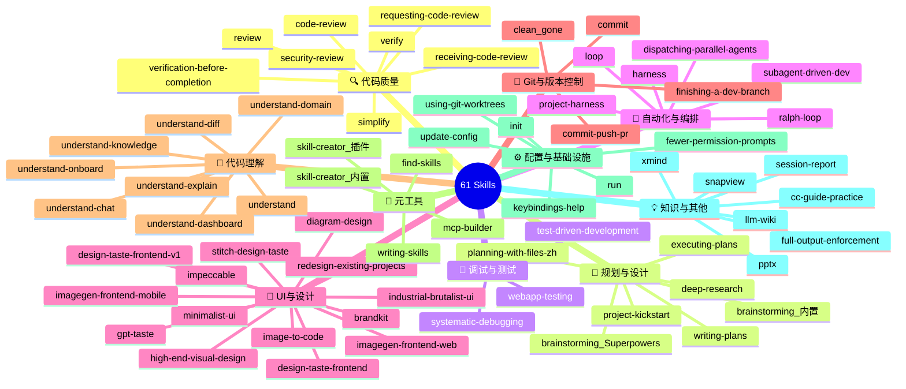
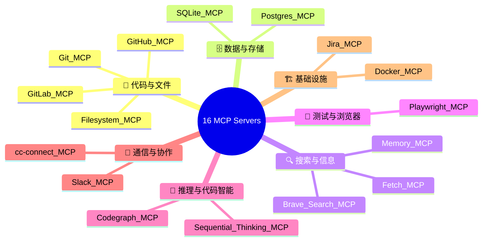

# Skills & MCPs 思维导图 + 重叠分析

> [AI-ARCH]-[DOC]-[SKILLS-002] — 按类别和作用分类的全景思维导图，含功能重叠/冲突分析

---

## 目录

1. [全景思维导图](#1-全景思维导图)
2. [按作用分类速查](#2-按作用分类速查)
3. [功能重叠与冲突分析](#3-功能重叠与冲突分析)
4. [推荐精简方案](#4-推荐精简方案)

---

## 1. 全景思维导图

### Skills 思维导图



### MCPs 思维导图



---

## 2. 按作用分类速查

### Skills 分类矩阵

| 作用域 | 内置 Skill | Superpowers 插件 | UA 插件 | Commit 插件 | Agent Skill | 其他 |
|--------|-----------|-----------------|---------|------------|-------------|------|
| **写代码前** | brainstorming, planning-with-files-zh, deep-research, project-kickstart | brainstorming, writing-plans | understand, understand-domain | — | diagram-design | — |
| **写代码中** | — | test-driven-development, subagent-driven-dev, dispatching-parallel-agents | — | — | image-to-code, imagegen-* | full-output-enforcement |
| **写代码后** | code-review, simplify, verify, security-review | verification-before-completion, requesting-code-review, receiving-code-review | understand-diff | — | design-taste-*, minimalist-ui, impeccable, gpt-taste | — |
| **提交时** | — | finishing-a-dev-branch | — | commit, commit-push-pr, clean_gone | — | — |
| **调试时** | webapp-testing | systematic-debugging | understand-explain, understand-knowledge | — | snapview | — |
| **学习中** | — | — | understand, understand-chat, understand-dashboard, understand-onboard | — | llm-wiki | — |
| **长期跑** | harness, project-harness, loop, ralph-loop | — | — | — | — | — |
| **建工具** | skill-creator, mcp-builder, find-skills | writing-skills | — | — | — | — |
| **管配置** | init, run, update-config, fewer-permission-prompts, keybindings-help | using-git-worktrees | — | — | — | session-report |
| **搞设计** | — | — | — | — | brandkit, stitch-design-taste, redesign-existing-projects, industrial-brutalist-ui, high-end-visual-design | — |
| **写文档** | pptx | — | — | — | — | xmind |

### MCPs 分类矩阵

| 作用域 | MCP Server | 安装方式 | 优先级 |
|--------|-----------|---------|--------|
| **代码托管** | GitHub, Git, GitLab | `npx -y @anthropic/mcp-server-*` | ⭐⭐⭐⭐⭐ |
| **文件访问** | Filesystem | `npx -y @anthropic/mcp-server-filesystem <path>` | ⭐⭐⭐⭐⭐ |
| **数据库** | Postgres, SQLite | `npx -y @anthropic/mcp-server-*` | ⭐⭐⭐⭐ |
| **Web测试** | Playwright | `npx -y @anthropic/mcp-server-playwright` | ⭐⭐⭐⭐ |
| **代码智能** | Codegraph | 内置 | ⭐⭐⭐⭐⭐ |
| **搜索** | Brave Search, Fetch | `npx` / 内置 | ⭐⭐⭐⭐ |
| **思考** | Sequential Thinking | 内置 | ⭐⭐⭐⭐ |
| **记忆** | Memory | 内置 | ⭐⭐⭐⭐ |
| **通信** | Slack, cc-connect | 社区维护 | ⭐⭐⭐ |
| **运维** | Docker, Jira | 社区维护 | ⭐⭐ |

---

## 3. 功能重叠与冲突分析

### 🔴 高度重叠（建议只保留一个）

| 重叠组 | 涉及 Skill | 重叠程度 | 建议 |
|--------|-----------|---------|------|
| **Skill 创建三件套** | `skill-creator`(内置) + `skill-creator`(插件) + `writing-skills`(Superpowers) | ⭐⭐⭐⭐⭐ 完全重叠 | 任选一个即可。推荐 `skill-creator`(内置)，它最轻量 |
| **Brainstorming 双版本** | `brainstorming`(内置) + `brainstorming`(Superpowers) | ⭐⭐⭐⭐ 高度重叠 | Superpowers版更结构化（含评分），日常用内置版足够 |
| **验证双版本** | `verify`(内置) + `verification-before-completion`(Superpowers) | ⭐⭐⭐⭐ 高度重叠 | Superpowers版更全面（含文档检查），简单验证用内置版 |
| **设计品味双版本** | `design-taste-frontend`(v1) + `design-taste-frontend` | ⭐⭐⭐⭐⭐ 同一Skill的版本差异 | 保留一个即可，v1和普通版择一 |

### 🟡 部分重叠（互补但可精简）

| 重叠组 | 涉及组件 | 重叠程度 | 关系说明 |
|--------|---------|---------|---------|
| **代码审查三阶段** | `code-review` + `requesting-code-review` + `receiving-code-review` | ⭐⭐⭐ 同一流程的不同阶段 | 互补不冲突。`code-review`做审查，另外两个管发起和接收 |
| **自动化双层级** | `harness`(内置Skill) vs `project-harness`(项目框架) | ⭐⭐⭐ 不同层级 | 互补。harness是单个长时间任务，project-harness是跨会话编排 |
| **定时双方案** | `loop`(会话内) vs `cron`(工具) | ⭐⭐⭐ 同一需求的两种实现 | 互补。loop适合开发中轮询，cron适合跨会话定时 |
| **测试双层面** | `webapp-testing`(Skill) vs `Playwright MCP`(底层) | ⭐⭐ 依赖关系 | 互补。webapp-testing内部调用Playwright MCP |
| **搜索双来源** | `deep-research`(内置搜索) vs `Brave Search MCP`(外部) | ⭐⭐ 不同搜索源 | 互补。可叠加使用获取更多信息源 |

### 🟢 无冲突（正常互补）

| 组合 | 关系 |
|------|------|
| `understand-*` 系列 8 个 | 同一插件的不同子功能，各司其职 |
| 14 个 Agent 设计 Skill | 不同设计风格/用途，互不冲突 |
| MCP Server 之间 | 各自独立的外部服务，互不干扰 |
| Skill vs MCP | Skill 是工作流，MCP 是外部连接，本质不同 |

---

## 4. 推荐精简方案

### 当前：61 Skills → 精简后：~40 Skills

| 操作 | 涉及 Skill | 理由 |
|------|-----------|------|
| ✂️ 二选一 | `skill-creator`(内置) **或** `writing-skills` | 功能完全重叠 |
| ✂️ 二选一 | `brainstorming`(内置) **或** `brainstorming`(Superpowers) | 高度重叠 |
| ✂️ 二选一 | `verify` **或** `verification-before-completion` | 日常verify够用 |
| ✂️ 二选一 | `design-taste-frontend` **或** `design-taste-frontend-v1` | 同功能不同版本 |
| ✅ 保留全部 | `code-review` + `requesting` + `receiving` | 审查流程三阶段互补 |
| ✅ 保留全部 | `harness` + `project-harness` | 不同层级 |
| ✅ 保留全部 | `loop` + `cron` | 不同使用场景 |
| ✅ 保留全部 | 14 个设计 Skill | 不同风格，按需使用 |
| ✅ 保留全部 | 8 个 understand-* | 同一插件的子功能 |

### MCP 安装建议

```
必须装（开发必备）：
  ✅ GitHub/GitLab    — 代码托管
  ✅ Git              — 版本控制
  ✅ Filesystem       — 文件安全访问

推荐装（提效明显）：
  ✅ Postgres/SQLite  — 数据库直连
  ✅ Playwright       — Web E2E 测试
  ✅ Brave Search     — 外部搜索

按需装（特定场景）：
  ⬜ Slack            — 团队通知
  ⬜ Docker           — 容器管理
  ⬜ Jira             — 项目管理
```

---

> **最后更新**: 2026-06-08
> **配套文档**: [README.md](./README.md) / [../tools/claude-code-commands.md](../tools/claude-code-commands.md)
